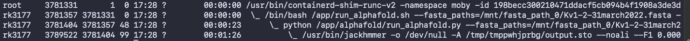
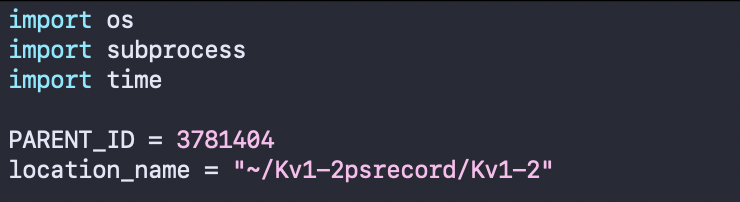
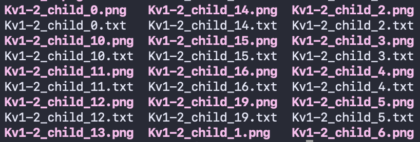

# AlphaFold Tutorial: Installing AlphaFold
By: Ranger Kuang 
<br>
Last Updated: 5 May 2022
<br>
<br>
[DeepMind's AlphaFold](https://github.com/deepmind/alphafold) github page has extensive and comprehensive details on installing AlphaFold. However, I will mention some of the nuances and issues that I ran into when installing AlphaFold onto md22. 
## On Installing Docker
Docker may be already up and running on the lab's servers (for md22, it was already installed). If Docker is already installed, you do not have to worry about the step of installing Docker. 
## On Installing Python Dependencies
When installing the Python dependencies, it is highly recommended to install them on a Python Virtual Environment. 
### Utilizing OpenFold's virtual environment
One possible method (easy, though not rigorously secure) is to take advantage of OpenFold's installation, which conveniently creates a miniconda environment. Since OpenFold is a replica of AlphaFold, most of the dependencies align anyways. Furthermore, you do not have to worry about giving different people permission to enter the virtual environment as OpenFold makes it easy to enter and leave the environment. 
<br>
<br>
Here is the segment on [OpenFold's github page](https://github.com/aqlaboratory/openfold) relevant to creating the miniconda environment:
> For convenience, we provide a script that installs Miniconda locally, creates a 
`conda` virtual environment, installs all Python dependencies, and downloads
useful resources (including DeepMind's pretrained parameters). Run:

```bash
scripts/install_third_party_dependencies.sh
```

> To activate the environment, run:

```bash
source scripts/activate_conda_env.sh
```

> To deactivate it, run:

```bash
source scripts/deactivate_conda_env.sh
```
If you use the OpenFold method, just remember to run this command within your virtual environment so that all of AlphaFold's dependencies are installed:
```
pip3 install -r docker/requirements.txt
```
## Other Miscellaneous Tips
1. Don't forget to clone the actual AlphaFold repo! 
```
git clone https://github.com/deepmind/alphafold.git
```
2. Remember to build AlphaFold's docker image! You may run into an error if you don't have permission to build docker images; if this is the case, get permission or have someone who does have permission to do this step. Also, build the docker within the virtual environment that has all the python dependencies required to run AlphaFold.
```
docker build -f docker/Dockerfile -t alphafold .
```
3. Sometimes, AlphaFold's docker image may be removed for some odd reason. If this is the case, just rerun the command above. You can always check to see if AlphaFold's docker image still exists by running: 
```
docker images
```
You should see something like:
```
alphafold     latest     4fa3bdfdafd2     5 weeks ago     12.4G
```

# AlphaFold Tutorial: Running Inferences
**AlphaFold md22 repo originally pulled on: 4 February 2022**
<br>
<br>
AlphaFold is currently set up and run on md22. This tutorial may not touch upon every aspect of AlphaFold or always go into full detail; for comprehensive information on AlphaFold, refer to [DeepMind's AlphaFold](https://github.com/deepmind/alphafold) github page. Notably, the first 5 bullet points underneath "Running AlphaFold" may be usefult to read.
<br>
<br>
The github repo lives at `/fisher/alphafold/alphafold` on md22.

## Preparing sequence files
FASTA files should be placed in a subdirectory under `/fisher/alphafold/inferences`. If nohup is used, you should also create a `<NOHUP>.out` file within your subdirectory. 
### Monomer files 
If you have a monomer of sequence `<SEQUENCE>`, your fasta file should look like: 
```
>sequence_name
<SEQUENCE>
```
### Homomer files 
If you have a multimer of the same sequence `<SEQUENCE>` a number of files: 
```
>sequence_1
<SEQUENCE>
>sequence_2
<SEQUENCE>
>sequence_3
<SEQUENCE>
```

### Heteromer files 
If you have a multimer that has, for example, 2 copies of `<SEQUENCE A>` and 3 copies of `<SEQUENCE B>`:
```
>sequence_1
<SEQUENCE A>
>sequence_2
<SEQUENCE A>
>sequence_3
<SEQUENCE B>
>sequence_4
<SEQUENCE B>
>sequence_5
<SEQUENCE B>
```

## Running inferences
1. Run `cd /fisher/openfold/openfold`
2. Run `source scripts/activate_conda_env.sh`. This causes you to join a virtual python environment originally intended for using OpenFold. We will use it here as it has all the required python packages necessary to successfully run AlphaFold. There should be a `(openfold_venv)`in front of your name if done correctly.  
3. Run `cd /fisher/alphafold/alphafold`
4. The general template for running AlphaFold on a sequence is: 
```
python3 docker/run_docker.py \
  --fasta_paths=<FASTA_PATH> \
  --is_prokaryote_list=false \
  --max_template_date=2022-01-01 \
  --model_preset=<MODEL_PRESET> \
  --data_dir=/fisher/openfold/openfold/data
```
You may use `nohup` so you don't need to stay connected to the server via ssh while AlphaFold runs. This is highly recommended, as longer sequences and multimers can take multiple days to run. To use `nohup`, run: 
```
nohup python3 docker/run_docker.py \
  --fasta_paths=<FASTA_PATH> \
  --is_prokaryote_list=false \
  --max_template_date=2022-01-01 \
  --model_preset=<MODEL_PRESET> \
  --data_dir=/fisher/openfold/openfold/data \
  > /fisher/alphafold/inferences/<FASTA_DIR>/<NOHUP_OUT>.out &
```
* `fasta_paths` should be the one you created previously in the inferences directory.For example: `/fisher/alphafold/inferences/YWHAG/YWHAG.fasta`
* `is_prokaryote_list` is optional and may be removed. Flag it true if all input sequences in the given fasta file are prokaryotic. If that is not the case or the origin is unknown, set to false 
monomer: This is the original model used at CASP14 with no ensembling.
* If you are predicting the structure of a protein that is already in PDB and you wish to avoid using it as a template, then `max_template_date` must be set to be before the release date of the structure. If you are using a specific protein from the Protein Data Bank as a template model, a good date to use is the release date of that specific model.
* `model_preset` has a number of options depending on your fasta file (this is just a copy-and-paste from DeepMind's github page):
    * __monomer__: This is the original model used at CASP14 with no ensembling.
    * __monomer_casp14__: This is the original model used at CASP14 with num_ensemble=8, matching our CASP14 configuration. This is largely provided for reproducibility as it is 8x more computationally expensive for limited accuracy gain (+0.1 average GDT gain on CASP14 domains).

    * __monomer_ptm__: This is the original CASP14 model fine tuned with the pTM head, providing a pairwise confidence measure. It is slightly less accurate than the normal monomer model.
      * Additional information on this can be found AlphaFold's official github page
    * __multimer__: This is the AlphaFold-Multimer model. To use this model, provide a multi-sequence FASTA file. In addition, the UniProt database should have been downloaded (which we have).
* You do not need to touch `data_dir`

## Output of AlphaFold
The output by default goes to `/tmp/alphafold/<SUB_DIR>` where `<SUB_DIR>` will be whatever you named your fasta file. Information on the contents of each output file can be found at DeepMind's AlphaFold github page, under the ["Alphafold Output"](https://github.com/deepmind/alphafold#alphafold-output) section. 

## Tracking Memory Usage
It may be useful at times to track the CPU usage of AlpahFold, given that it is incredibly memory-intensive. There are two main ways that I have currently set up:
1. Using the pre-installed package `psrecord` 
2. Using my custom-made python script (not quite accurate, slightly buggy, and overall not very recommended). 
### Option 1: Using `psrecord` natively 
1. In one terminal window, prepare and run alphafold as you normally would, for example `nohup python3 docker/run_docker.py`... 
2. In a new window, run `conda activate psrecord`. (You may need to `cd /home/rk3177` before entering the conda environment). If done correctly, a `(psrecord)` should appear before your name in the command line.
3. Run `ps -ef --forest`. 
    * When running this script, the first column is the user, the second column is the process ID (PID) of the process, and the third column is the PID of the parent process. 
    * Find the process ID that refers to the AlphaFold script, which will be the process that has `python /app/alphagold/run_alphafold.py --fasta_paths=...`
    *  In the example above our PID of interest is the 3rd process listed, with a PID = `3781404`
4. Run 
```
nohup psrecord <PID> \
  --log <LOG_FILE>.txt \
  --plot <PLOT_FILE>.png \
  --interval <SECONDS> \
  --include-children \
  > <NOHUP_OUT>.out &
```
  * The `nohup` allows you to keep the process running even if your ssh disconnects
  * `<PID>` should be replaced with the PID found in step 3
  * The `--log ...` will allow psrecord to log the CPU usage of the process
  * `--plot ...` will conveniently plot the information in the log file. This is optional and can be removed if you want. 
  * `--interval ...` is optional, but highly recommended to be put at 5 to 10 seconds (or higher). Otherwise, psrecord will try to record the CPU usage of `<PID>` every possible instant it can, which will actually become so resource-intensive that the prescord script itself will begin to eat up large amounts of CPU 
  *  `--include-children` will ensure all child processes of our script are recorded as well, which is very important as AlphaFold uses many child processes! 
### Option 2: Ranger's custom-made script (not recommended)
1. Repeat steps 1-3 of Option 1 listed above 
2. Open up the file `/home/rk3177/psrecord_custom.py`. Near the top, you should see two lines of code that are important: `PARENT_ID` and `location_name` 
    *  
    * `PARENT_ID` should be set to the `<PID>` that was found originally using `ps -ef --forest` 
    * `location_name` should be the location of where you want the script to output all of its log and plot files 
3. Run `nohup python3 psrecord_custom.py > <NOHUP_OUT>.out &`
4. The only advantage this custom-made script has over Option 1 is that this script tries to make explicit log/plot files for each child process that AlphaFold runs. That is why the script will output a mess of files that looks like this: 
 
<br>
However, the CPU usage numbers given by these separate log files do not accurately match up with just using `psrecord` natively, so I am not confident in the accuracy of this script's output. 

# Postscript on OpenFold
**OpenFold local repo originally pulled on: Dec. 10, 2021**
<br>
If OpenFold is wished to be used, you may find comprehensive information at the [OpenFold github page](https://github.com/aqlaboratory/openfold). Know that all databases should have been downloaded, and the repo should be ready to run inferences. The github repo lives at `/fisher/openfold/openfold`, while past FASTA files have been stored at `/fisher/openfold/inferences`. 